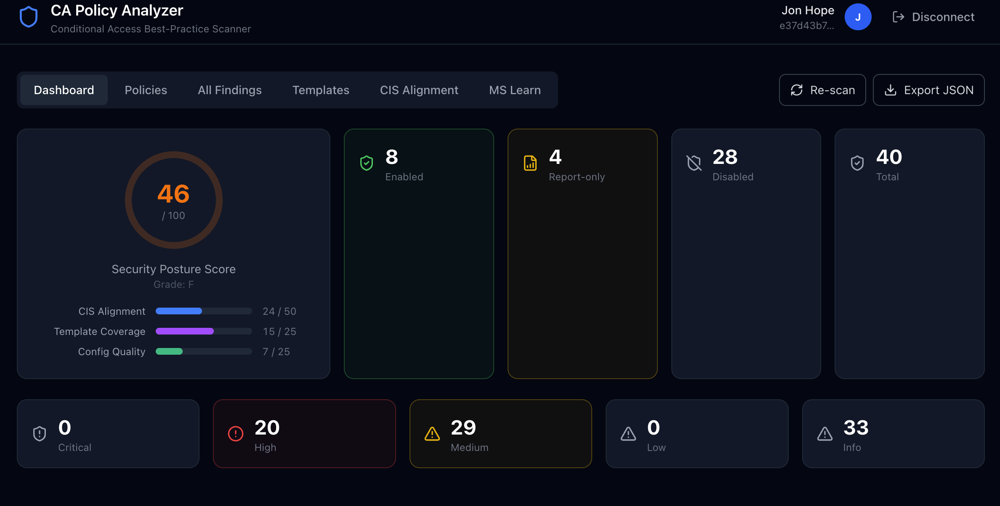
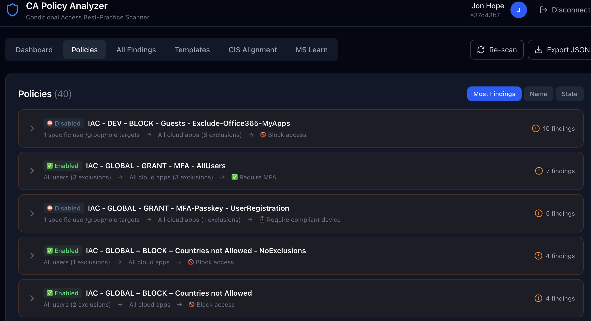
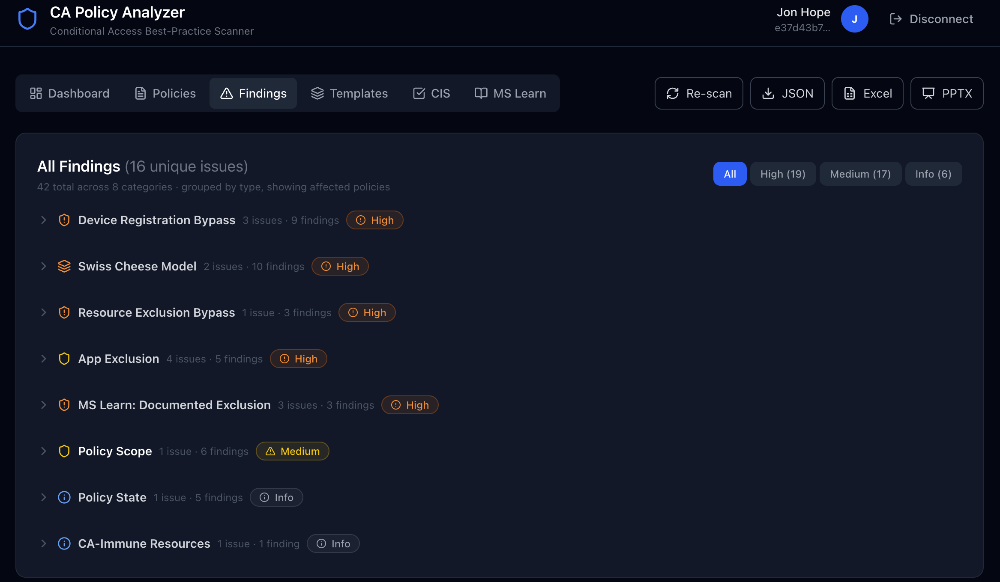
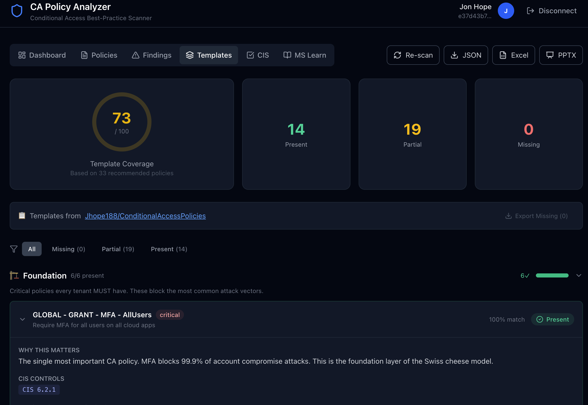
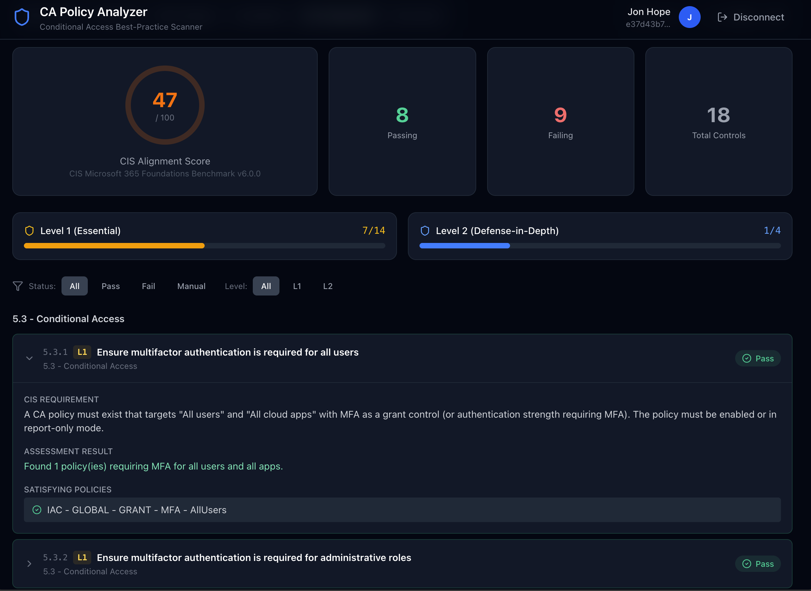
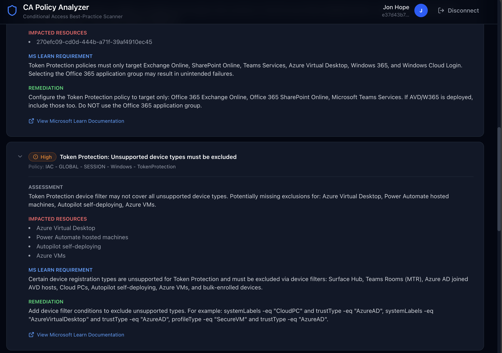

# CA Policy Analyzer

> Analyze your Entra ID Conditional Access policies for best practices, FOCI token-sharing risks, known CA bypasses, CIS v6.0 benchmark alignment, and MS Learn documented exclusions — **directly in your browser, no install required.**

[](https://jhope188.github.io/ca-policy-analyzer)
  

## 🚀 Try It Now

**No download. No install. No server.**

👉 **[https://jhope188.github.io/ca-policy-analyzer](https://jhope188.github.io/ca-policy-analyzer)**

1. Click **Connect Tenant**
2. Sign in with your Entra ID credentials
3. Click **Run Analysis**
4. Explore the six analysis tabs: Dashboard, Policies, Findings, Templates, CIS, and MS Learn
5. Click **Export JSON** to download the full analysis results

The app runs **100% in your browser** — your data never leaves your machine. It connects directly to Microsoft Graph using your own credentials (delegated permissions).

---

## Screenshots

### Dashboard — Security Posture at a Glance

The dashboard shows your overall security score (0–100), policy counts by state, and a severity breakdown of all findings.

<!-- Replace with actual screenshot: open the app → run analysis → Dashboard tab -->


### Policies — Visual Flow Cards

Every CA policy is rendered as an expandable flow card showing Users → Conditions → Apps → Grant/Session Controls. Critical and high-severity policies are highlighted with coloured borders.

<!-- Replace with actual screenshot: open the app → Policies tab → expand a policy -->


### Findings — Severity-Ranked Issues

All detected issues ranked Critical → Info. Expand any finding to see the full description, affected policy, and a remediation recommendation.

<!-- Replace with actual screenshot: open the app → Findings tab → expand a finding -->


### Templates — Gap Analysis

33 best-practice templates compared against your tenant. Each template shows whether you have a matching policy, a partial match, or a gap.

<!-- Replace with actual screenshot: open the app → Templates tab -->


### CIS v6.0 — Benchmark Alignment

18 controls from the CIS Microsoft 365 Foundations Benchmark v6.0.0 with an alignment score ring. Each control shows pass/fail status, matching policies, and remediation guidance.

<!-- Replace with actual screenshot: open the app → CIS tab -->


### MS Learn — Documented Exclusion Checks

12 checks sourced from Microsoft Learn flag policies that are missing required exclusions. Findings are grouped by severity and each card links to the relevant documentation.

<!-- Replace with actual screenshot: open the app → MS Learn tab -->


> **Adding your own screenshots:** Capture each tab and save the images to `docs/screenshots/` with the filenames shown above (`dashboard.png`, `policies.png`, `findings.png`, `templates.png`, `cis.png`, `mslearn.png`).

---

## What It Does

CA Policy Analyzer connects to your Entra ID tenant via Microsoft Graph and:

1. **Reads all Conditional Access policies** including users, apps, conditions, and grant/session controls
2. **Checks for best-practice violations** using research from [Fabian Bader](https://cloudbrothers.info/en/conditional-access-bypasses/) and [EntraScopes.com](https://entrascopes.com)
3. **Detects FOCI risks** — if a policy excludes one FOCI app, ALL 45+ family members can share tokens
4. **Flags known CA bypasses** including CA-immune resources, Device Registration Service bypass, resource exclusion scope leaks, and more
5. **Generates a Security Posture Score** (0-100) with severity-ranked findings and actionable recommendations
6. **Visualizes each policy** showing the flow: Users → Conditions → Apps → Grant Controls
7. **Suggests missing policy templates** from [Jhope188/ConditionalAccessPolicies](https://github.com/Jhope188/ConditionalAccessPolicies) — 33 best-practice templates matched against your existing policies
8. **Measures CIS v6.0 alignment** — 18 controls from CIS Microsoft 365 Foundations Benchmark v6.0.0 with pass/fail scoring
9. **Flags MS Learn documented exclusions** — 12 checks for missing exclusions that Microsoft documents as required (Surface Hub, Teams Rooms, break-glass accounts, token protection prerequisites, etc.)
10. **Exports full analysis as JSON** — download your results for offline review or integration with other tools

## Interface

The app has six tabs accessible after running an analysis:

| Tab | What It Shows |
|---|---|
| **Dashboard** | Security posture score (0–100), severity breakdown, risk category distribution, and at-a-glance stats |
| **Policies** | Every CA policy visualized as a flow card: Users → Conditions → Apps → Grant/Session Controls |
| **Findings** | All detected issues ranked by severity (Critical → Info) with affected policies and remediation guidance |
| **Templates** | 33 best-practice policy templates compared against your tenant — shows matched, partial, and missing policies |
| **CIS** | CIS Microsoft 365 Foundations Benchmark v6.0.0 alignment — 18 controls across sections 5.3 (Conditional Access) and 5.4 (Identity Protection & Device Controls) |
| **MS Learn** | Documented exclusion checks sourced from Microsoft Learn — flags policies missing required exclusions for token protection, Surface Hub, Teams Rooms, break-glass, CAE, and more |

### Export / Download

Click the **Export JSON** button (visible when results are loaded) to download the complete analysis as a JSON file, including all findings, CIS results, exclusion checks, and raw policy data.

## Key Checks

| Category | What It Detects |
|---|---|
| **FOCI Token Sharing** | Excluded apps that belong to the Family of Client IDs — tokens interchangeable across 45+ Microsoft apps |
| **Resource Exclusion Bypass** | Excluding ANY app from "All cloud apps" leaks Azure AD Graph & MS Graph basic scopes |
| **CA-Immune Resources** | 6 Microsoft resources completely excluded from CA enforcement (always notApplied) |
| **Device Registration Bypass** | Device Registration Service ignores location and device compliance — only MFA works |
| **Swiss Cheese Model** | Grant controls using OR instead of AND, missing MFA baseline layer |
| **Legacy Authentication** | Legacy auth clients targeted but not blocked |
| **Known CA Bypass Apps** | Apps with documented CA bypass capabilities (Azure CLI, PowerShell, AAD Connect, etc.) |
| **Tenant-Wide Gaps** | Missing MFA-for-all, no legacy auth block, no break-glass accounts |

## CIS Benchmark Controls (v6.0.0)

18 controls from CIS Microsoft 365 Foundations Benchmark v6.0.0:

| Control | Title | Level |
|---|---|---|
| 5.3.1 | MFA required for all users | L1 |
| 5.3.2 | MFA required for administrative roles | L1 |
| 5.3.3 | MFA required for guest and external users | L1 |
| 5.3.4 | Phishing-resistant MFA for administrators | L1 |
| 5.3.5 | MFA required to register or join devices | L1 |
| 5.3.6 | Sign-in risk policy configured | L1 |
| 5.3.7 | User risk policy configured | L1 |
| 5.3.8 | Access from non-allowed countries blocked | L1 |
| 5.3.9 | Legacy authentication blocked | L1 |
| 5.3.10 | Continuous access evaluation not disabled | L1 |
| 5.3.11 | Unknown/unsupported device platforms blocked | L1 |
| 5.3.12 | Device code flow blocked | L1 |
| 5.3.13 | Sign-in frequency for admin portals limited | L2 |
| 5.4.1 | High-risk users blocked | L1 |
| 5.4.2 | High-risk sign-ins blocked | L1 |
| 5.4.3 | Compliant device requirement configured | L2 |
| 5.4.4 | Token protection for sensitive applications | L2 |
| 5.4.5 | App protection policy for mobile devices | L2 |

## MS Learn Documented Exclusion Checks

12 checks sourced from Microsoft Learn documentation:

| Check | Severity | What It Flags |
|---|---|---|
| Token Protection — Apps | Critical | Targeting "All apps" instead of only Exchange/SPO/Teams/AVD/W365 |
| Token Protection — Platform | High | Not restricting to Windows-only + desktop clients |
| Token Protection — Devices | High | Missing Surface Hub, Teams Rooms, Cloud PC device exclusions |
| Break-glass accounts | Critical | All Users enforcement policies with no user exclusions |
| Surface Hub — MFA | High | MFA/compliance policies without Surface Hub exclusion |
| Teams Rooms — MFA | High | MFA/auth strength policies without Teams Rooms exclusion |
| Teams Rooms — Sign-in frequency | Medium | Sign-in frequency causing periodic sign-outs |
| Device code flow — Teams Android | Medium | Blocking device code breaks Teams Android remote sign-in |
| Defender Mobile | Medium | Restrictive policies without Defender ATP exclusion |
| Sign-in frequency — Individual services | Medium | Targeting individual M365 services breaks Teams |
| CAE disabled | High | Policies explicitly disabling continuous access evaluation |
| Resilience disabled | Medium | Policies disabling resilience defaults |

## Examples

### Example: Finding — FOCI Token Sharing Risk

When the analyzer detects a policy that excludes a FOCI app, it produces a finding like this:

```
┌──────────────────────────────────────────────────────────────┐
│ 🔴 Critical  F-0003  FOCI Token Sharing                     │
│                                                              │
│ FOCI app excluded: Microsoft Teams (1fec8e78-bce4-...)       │
│                                                              │
│ Policy: "Block all except core apps"                         │
│                                                              │
│ This policy excludes Microsoft Teams, which belongs to FOCI  │
│ family "Microsoft Office". Excluding one FOCI member means   │
│ all 45+ apps in the family can share refresh tokens to       │
│ bypass this policy entirely.                                 │
│                                                              │
│ 💡 Recommendation: Instead of excluding FOCI apps from a     │
│    block/MFA policy, create a dedicated allow policy for     │
│    the specific app.                                         │
└──────────────────────────────────────────────────────────────┘
```

### Example: CIS Control — Pass vs Fail

The CIS tab shows each of the 18 v6.0 controls with a pass/fail badge, matched policies, and remediation if failing:

```
✅ 5.3.1 — Ensure multifactor authentication is required for all users    [L1]
   Found 2 policy(ies) requiring MFA for all users and all apps.
   Policies: "CA001 — Require MFA for all users", "Baseline — MFA"

❌ 5.3.4 — Ensure phishing-resistant MFA for administrators               [L1]
   No policy enforces phishing-resistant authentication strength for admin roles.
   Remediation: Create a CA policy targeting admin roles with authentication
   strength set to "Phishing-resistant MFA" (FIDO2, CBA, Windows Hello).

✅ 5.3.10 — Ensure continuous access evaluation is not disabled            [L1]
   No policy disables continuous access evaluation. CAE is active.
```

### Example: MS Learn Exclusion — Token Protection Misconfiguration

If a token protection policy targets "All cloud apps" instead of only the supported services, the MS Learn tab flags it:

```
┌──────────────────────────────────────────────────────────────┐
│ 🔴 Critical — Token Protection: Unsupported App Scope        │
│                                                              │
│ Policy: "Require token protection"                           │
│                                                              │
│ Assessment: Token protection only works with Exchange         │
│ Online, SharePoint Online, and Teams. This policy targets    │
│ "All cloud apps" which will cause sign-in failures for       │
│ unsupported applications.                                    │
│                                                              │
│ 📖 MS Learn Requirement: Target only Exchange Online         │
│    (00000002-0000-0ff1-ce00-000000000000), SharePoint        │
│    Online (00000003-0000-0ff1-ce00-000000000000), and        │
│    Microsoft Teams Services.                                 │
│                                                              │
│ Remediation: Change the policy to target only Exchange       │
│ Online, SharePoint Online, Teams, Azure Virtual Desktop,     │
│ and Windows 365.                                             │
│                                                              │
│ 🔗 https://learn.microsoft.com/en-us/entra/identity/...     │
└──────────────────────────────────────────────────────────────┘
```

### Example: Template Gap — Missing Policy

The Templates tab highlights best-practice policies you haven't implemented yet:

```
❌ Missing — Block legacy authentication
   Template: CA006-Global-BlockLegacyAuthentication
   No matching policy found in your tenant.
   Description: Block Exchange ActiveSync and other legacy
   auth clients for all users.

🟡 Partial match — Require compliant device for mobile
   Template: CA012-Global-RequireCompliantDevice-Mobile
   Your policy "Device compliance — iOS" covers iOS but
   does not include Android. Match score: 62%
```

### Example: Exported JSON Structure

The **Export JSON** button downloads the full analysis. The JSON follows this structure:

```jsonc
{
  "tenantSummary": {
    "totalPolicies": 24,
    "enabledPolicies": 18,
    "reportOnlyPolicies": 4,
    "disabledPolicies": 2,
    "totalFindings": 13,
    "criticalFindings": 2,
    "highFindings": 4,
    "mediumFindings": 5,
    "lowFindings": 1,
    "infoFindings": 1
  },
  "overallScore": 72,
  "findings": [
    {
      "id": "F-0001",
      "policyId": "aaaa-bbbb-...",
      "policyName": "Block all except core apps",
      "severity": "critical",
      "category": "FOCI Token Sharing",
      "title": "FOCI app excluded — entire family can bypass this policy",
      "description": "...",
      "recommendation": "..."
    }
    // ... additional findings
  ],
  "exclusionFindings": [
    {
      "checkId": "token-prot-apps",
      "severity": "critical",
      "title": "Token Protection: Unsupported App Scope",
      "policyName": "Require token protection",
      "assessment": "...",
      "requirement": "...",
      "remediation": "...",
      "docUrl": "https://learn.microsoft.com/..."
    }
    // ... additional exclusion findings
  ],
  "policyResults": [
    // Full policy data + per-policy findings + flow visualization
  ]
}
```

---

## Privacy & Security

- **No backend server** — the app is static HTML/JS/CSS hosted on GitHub Pages
- **No data collection** — your policies, tokens, and tenant data stay in your browser session
- **Delegated auth only** — the app can only do what your signed-in user can do
- **Open source** — review every line of code in this repo

### Required Permissions

The app requests these Microsoft Graph **delegated** permissions when you sign in:

| Permission | Why |
|---|---|
| `Policy.Read.All` | Read Conditional Access policies |
| `Application.Read.All` | Resolve service principal names referenced in policies |
| `Directory.Read.All` | Resolve groups, roles, and users referenced in policies |

Your tenant admin must grant consent for these permissions. The app uses a multi-tenant app registration — no per-tenant setup needed.

## For Developers

If you want to run locally, fork, or contribute:

### Prerequisites

- Node.js 18+
- npm

### Local Development

```bash
git clone https://github.com/Jhope188/ca-policy-analyzer.git
cd ca-policy-analyzer
npm install
npm run dev
```

Open http://localhost:3000 and click **Connect Tenant**.

> **Note:** The app comes with a built-in Client ID for the hosted app registration. If you fork this project and want to use your own, set `NEXT_PUBLIC_MSAL_CLIENT_ID` in a `.env.local` file.

### Building for Production

```bash
npm run build    # Outputs static site to ./out
```

The GitHub Actions workflow in `.github/workflows/deploy-pages.yml` automatically builds and deploys to GitHub Pages on every push to `main`.

### Architecture

```
src/
├── app/            # Next.js App Router — main page with 6 tab views
├── components/     # Auth provider, header, dashboard, policy list, findings,
│                   #   templates view, CIS view, exclusions view, UI primitives
├── data/           # FOCI database (45 apps), CA bypass database (13 apps),
│                   #   CIS v6.0 benchmarks (18 controls), policy templates (23),
│                   #   MS Learn documented exclusions (12 checks)
└── lib/            # MSAL config, Graph client, analyzer engine (13 checks),
                    #   template matcher
```

### Tech Stack

- **Next.js 16** — Static export with App Router
- **MSAL.js** — Entra ID authentication (redirect flow)
- **Microsoft Graph** — Reads CA policies, service principals, named locations
- **Tailwind CSS 4** — Dark theme UI
- **TypeScript** — Full type safety across Graph responses and analysis results

## Research Credits

- **Fabian Bader** — Conditional Access bypasses (TROOPERS25)
- **Dirk-jan Mollema & Fabian Bader** — EntraScopes.com
- **Secureworks** — Family of Client IDs Research
- **Center for Internet Security (CIS)** — Microsoft 365 Foundations Benchmark v6.0.0
- **Microsoft Learn** — Conditional Access documented exclusions, token protection, Teams Rooms & Surface Hub compatibility

## License

MIT
